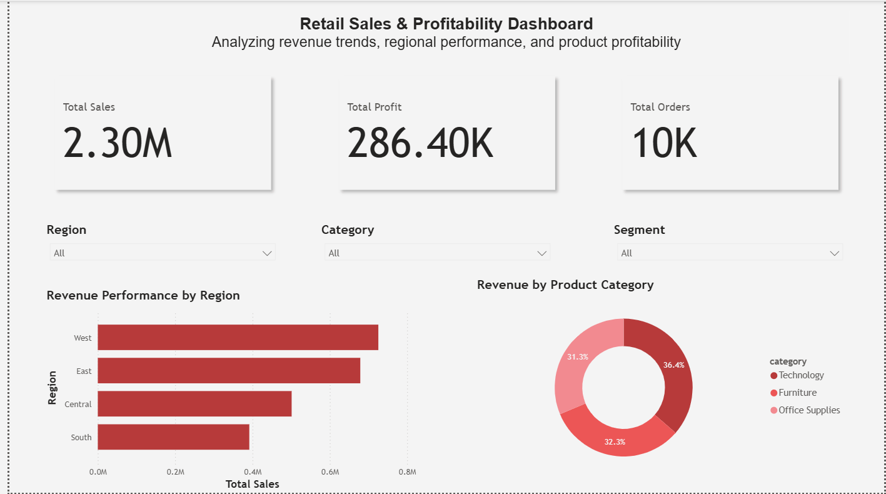
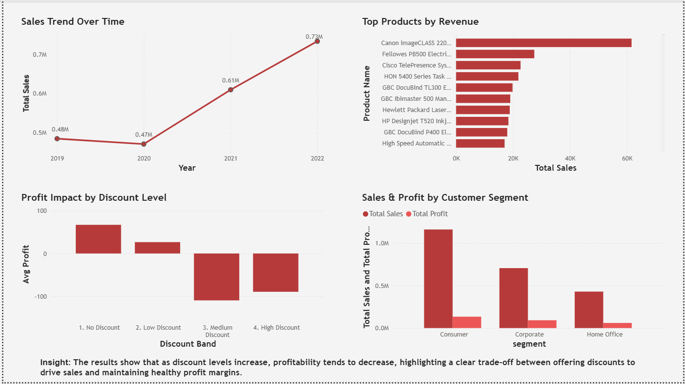

# Retail Sales Analytics Dashboard | SQL & Power BI

## Overview  
Analyzed retail sales data using **SQL** and built an interactive **Power BI dashboard** to identify key drivers of revenue and profitability. This project demonstrates an end-to-end data analysis workflow, from querying data to generating actionable business insights.

---

## Key Business Questions  
- Which products and regions drive the most profit?  
- Which products are unprofitable?
- How do discounts impact profitability?  
- What are the sales trends over time?  

---

## Tools Used  
- SQL  
- Power BI  
- Excel (CSV dataset)  

---

## Dashboard Highlights  
- KPI Cards: Total Sales, Profit, and Orders  
- Revenue by Region and Product Category  
- Sales Trend Over Time  
- Top 10 Products by Revenue  
- Profit Impact by Discount Levels  
- Sales and Profit by Customer Segment   

---

## Dashboard Preview  

---

## Key Insights  
- High discounts reduce **profit margins**  
- Some products consistently generate **losses**  
- Revenue is concentrated among **top customers**  
- Sales show clear **time-based trends**  
- Regional performance varies significantly  

---

## Recommendations  
- Optimize discount strategy to protect margins  
- Re-evaluate loss-making products  
- Focus on high-value customers  
- Use regional insights for targeted decisions  

---

## Skills Demonstrated  
- SQL: Data extraction, aggregation (**GROUP BY, HAVING, CASE, Views**)  
- Data Analysis: Identifying trends, profitability drivers and business insights  
- Power BI: Interactive dashboard design, data visualization, KPI development  

---

## Files  
- `orders.csv`  
- `superstore_sql_queries.sqbpro`  
- `superstore_dashboard.pbix`  
- `sales_dashboard_page_1.png`
- `sales_dashboard_page_2.png`
--- 

## Author

**Aarthi Rebecca**   